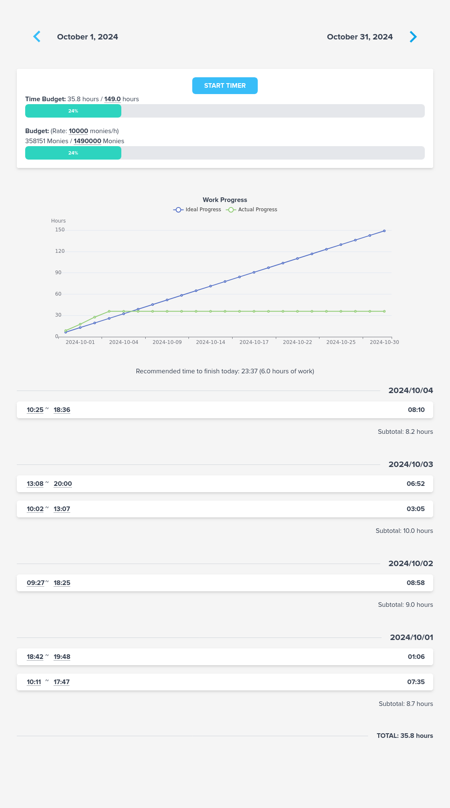
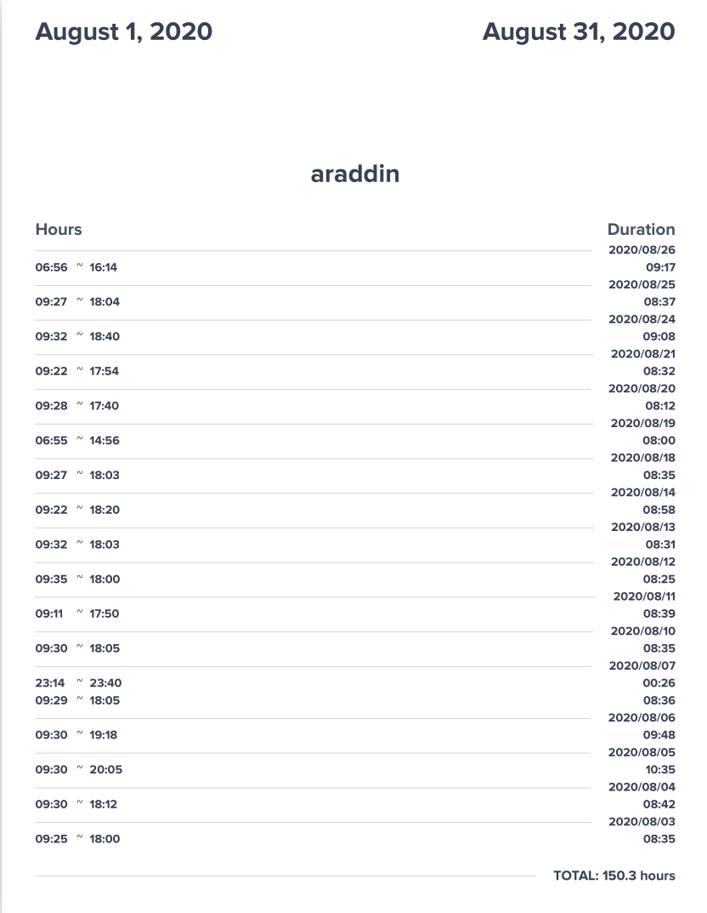

# timetr4cker

Track your working hours as a freelancer with an API and a very simple dashboard.

## Setup

I'm using:

- Svelte 5 
- Fastify
- pnpm

But you don't need to install those. Just install [Nix](https://nixos.org/download/) and [Direnv](https://direnv.net/) instead. 

Then type:

```
make
```

Then Timetracker will be available on http://localhost:1234 .  
It uses a local sqlite3 database directly so don't remove the project folder or you'll lose your data.  
There is no create project page, you can directly access your project timesheet by going to `http://localhost:1234/<YOUR PROJECT>`

Screenshots:

UI:

<a href="./assets/screenshot.png"></a>

Then when you try to print the page, you get a perfect PDF version you can give to your customer:

<a href="./assets/screenshot_pdf.png"></a>

